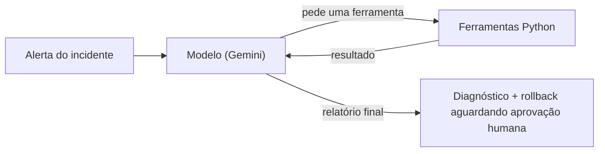

# Agente de IA Minimalista com Análise Temporal

Atividade da disciplina **Cloud Artificial Intelligence** (Prof. **Fernando Nemec**), apresentada em **02/10/2026**.

**Aluno:** Nickolas Corazza Alves (RM 562265)

Este repositório contém a evolução do *agente de IA minimalista* fornecido pelo professor: um agente que investiga incidentes de nuvem usando ferramentas. O trabalho acrescenta uma **ferramenta de análise temporal**, **dois problemas novos** que exigem olhar o tempo, um **avaliador automático**, e a **portabilidade do agente da OpenAI para o Google Gemini** (plano gratuito).

> Todos os números deste documento vêm de execuções reais feitas no meu computador. Onde a evidência é fraca, isso está dito de forma explícita (veja [Limitações](#limitações-o-que-este-trabalho-não-prova)).

---

## Sumário

1. [Resultados em resumo](#resultados-em-resumo)
2. [Conteúdo do repositório](#conteúdo-do-repositório)
3. [Como o agente funciona](#como-o-agente-funciona)
4. [O que foi desenvolvido](#o-que-foi-desenvolvido)
5. [Resultados detalhados](#resultados-detalhados)
6. [Evolução do agente (versões)](#evolução-do-agente-versões)
7. [Limitações](#limitações-o-que-este-trabalho-não-prova)
8. [Como executar](#como-executar)
9. [Configuração](#configuração)
10. [Segurança da chave de API](#segurança-da-chave-de-api)
11. [Próximos passos](#próximos-passos)

---

## Resultados em resumo

| Item pedido pelo professor | Situação |
|---|---|
| 1. Adicionar uma tool de análise temporal | **Feito:** `analisar_serie_temporal`. Funciona sozinha e o agente a usou em todas as execuções das avaliações mais recentes |
| 1.1. Modificar o mockup com um problema que exija investigação temporal | **Feito, com ressalva:** criei os cenários B e C. O B se mostrou fácil demais; o C exige tempo por construção, mas o efeito da tool nele não foi isolado |
| 2. Testar e avaliar o agente | **Feito:** 39 execuções automáticas com o modelo leve, mais 2 testes manuais com o modelo maior, com diagnóstico das falhas |
| 3. Portar para uma nova LLM, se fizer sentido | **Feito:** OpenAI (`gpt-5.6-luna`) para Gemini. Motivo: custo zero para aluno |
| Inovação e evolução (3 pontos) | Várias melhorias, cada uma motivada por um problema observado nos testes. Algumas não se mostraram eficazes, e isso está registrado |

**Principais achados:**

- A ferramenta temporal é tecnicamente correta: na saída real do teste sem IA, ela detecta a mudança de tendência da memória do `catalog-api` às **12:05** (margem de 5 min) e aponta o deploy `dep-451` (12:10) no mesmo instante.
- No cenário original (A), o agente acertou o rollback em **12 de 12** execuções nas quatro últimas avaliações.
- No cenário C, o modelo leve (`gemini-3.1-flash-lite`) acertou **0 de 9 com a tool e 0 de 9 sem ela**. Os relatórios mostraram o motivo: o agente confundia o **sintoma** (latência) com a **causa** e culpava o deploy mais próximo dele.
- Com um modelo maior (`gemini-3.5-flash`), o agente pediu o rollback correto em **2 de 2** execuções. São só 2 execuções, a cota gratuita impediu repetir, e o mesmo modelo **não foi testado sem a tool**. Portanto **não afirmo** que a ferramenta foi o motivo do acerto.

---

## Conteúdo do repositório

| Arquivo | Descrição |
|---|---|
| `Agente_Gemini_v4_1.ipynb` | Notebook final, com as saídas das execuções salvas |
| `Relatorio_Agente_IA_Analise_Temporal.pdf` | Relatório de 6 páginas: método, resultados, diagnóstico, limitações e anexos |
| `README.md` | Este documento |

---

## Como o agente funciona

O agente recebe o alerta de um incidente, escolhe uma ferramenta, lê o resultado e repete, até escrever um relatório final.



**As 8 ferramentas:**

| Ferramenta | O que faz |
|---|---|
| `consultar_metricas` | CPU, memória, latência p95, taxa de erro e instâncias (valores atuais) |
| `buscar_logs` | Linhas recentes de log de um serviço |
| `consultar_deploys` | Deploys recentes e suas mudanças |
| `consultar_configuracao` | Configuração operacional atual |
| `consultar_custos` | Custo atual por hora comparado ao baseline |
| `consultar_eventos_recentes` | Deploys, autoscaling e alertas dos **últimos 90 minutos** |
| **`analisar_serie_temporal`** | **Nova.** Evolução das métricas no tempo (detalhes abaixo) |
| `solicitar_rollback` | Apenas **abre um pedido**; a aprovação é humana. O agente é instruído a nunca dizer que o rollback foi executado |

---

## O que foi desenvolvido

### Ponto de partida (notebook do professor)

O notebook original usa a API da OpenAI (modelo `gpt-5.6-luna`), 7 ferramentas, no máximo 8 rodadas, 350 tokens de saída por rodada e teto de custo de US$ 0,02. O incidente original (**INC-2026-0911**) foi causado pelo deploy `dep-442` (13:58), que configurou o `recommendation-api` para chamar a si mesmo como fallback. A CPU foi a 98%, as instâncias de 2 para 48 e o custo de US$ 0,31 para US$ 7,44 por hora (24 vezes).

**Limitação observada:** as métricas são uma foto de um único instante e os eventos são uma lista pronta de 4 itens. O agente não tem como perguntar *"quando isso começou?"*. Por isso o cenário original **não exige** análise temporal.

### 1. A ferramenta `analisar_serie_temporal`

Recebe um serviço e, opcionalmente, uma métrica (`cpu_pct`, `memoria_pct`, `latencia_p95_ms` ou `taxa_erro_pct`).

**Como funciona:**

1. Testa cada horário como o possível "momento da quebra": antes dele a série é uma linha plana, depois dele é uma reta inclinada. O horário em que esse modelo melhor encaixa nos dados é o **ponto de mudança**.
2. Só declara mudança se o encaixe melhorar em pelo menos 50% em relação a uma linha única **e** a variação total for maior que 4 vezes o desvio padrão do ruído. Séries saudáveis saem como "estáveis".
3. Lista os deploys e eventos até 30 minutos antes ou depois do ponto de mudança, classificando cada um como **antes**, **depois** ou **no mesmo instante** (margem de erro de 5 minutos).

**Evolução depois dos testes** (cada uma motivada por uma falha observada, veja o [relatório](Relatorio_Agente_IA_Analise_Temporal.pdf)):

- **Varredura (v3.1):** sem informar a métrica, a ferramenta analisa as 4 métricas do serviço e mostra a **ordem** em que mudaram; a que muda primeiro costuma ser a origem.
- **Aviso de métrica anterior (v3.1):** ao analisar uma métrica, avisa se outra métrica do mesmo serviço mudou antes.
- **Checagem de inclinação (v3.2):** para cada deploy posterior à primeira mudança, verifica se ele alterou a inclinação da métrica de origem (`alterou_a_inclinacao`).

**Exemplo real** (saída do teste sem IA, cenário C, memória do `catalog-api`):

```json
{
  "servico": "catalog-api",
  "metrica": "memoria_pct",
  "janela": "11:00-16:15",
  "resolucao_min": 5,
  "valor_atual": 91.53,
  "tendencia": "mudanca detectada",
  "baseline_antes_da_mudanca": 54.81,
  "mudanca_de_tendencia": "12:05",
  "margem_de_erro_min": 5,
  "inclinacao_apos_mudanca_por_hora": 8.77,
  "variacao_pct_vs_baseline": 67.0,
  "eventos_proximos_da_mudanca": [
    {"hora": "12:10", "tipo": "deploy", "servico": "catalog-api", "id": "dep-451",
     "diferenca_min": 5, "posicao": "no mesmo instante (dentro da margem de erro)"}
  ]
}
```

### 1.1. Novos problemas no mockup

Adicionei ao mockup séries de **11:00 a 16:15** (5 em 5 minutos) geradas com `random.Random(semente)`: **os números são sempre os mesmos** em qualquer computador. Os dados são fictícios.

| Cenário | Causa real (gabarito) | Pistas falsas | Observação |
|---|---|---|---|
| **A** (original, INC-2026-0911) | `dep-442` (13:58): fallback recursivo | nenhuma | Não exige análise temporal. Mantido para provar que nada quebrou |
| **B** (INC-2026-0912) | `dep-451` (12:10): cache sem expiração; memória do `catalog-api` cresce 8,8 pontos por hora | `dep-455` (15:52, checkout): só um banner, veio **depois** do sintoma | **Falha de projeto minha:** a descrição do deploy dizia `cache_ttl_s: 300 -> 0` e entregava a resposta |
| **C** (INC-2026-0913) | `dep-451` (12:10): "refatoração do módulo de listagem" (sem pista textual) | `dep-453` (15:25): log em DEBUG; `dep-455` (15:52) | Criado depois que a avaliação mostrou que o B era fácil. Usa as mesmas séries do B |

**Linha do tempo do cenário C:**

| Hora | O que acontece |
|---|---|
| 12:10 | Deploy `dep-451` no `catalog-api`: a memória começa a crescer devagar (**causa real**) |
| 15:25 | Deploy `dep-453` no `catalog-api`: nível de log em DEBUG, a quente (pista falsa) |
| 15:30 | A memória chega a ~85%: pausas de GC, a latência do catalog dispara |
| 15:40 | O `checkout-api` começa a piorar (ele chama o catalog) |
| 15:52 | Deploy `dep-455` no `checkout-api`: banner (pista falsa 2) |
| 16:05 / 16:10 | Autoscaling do checkout (5 para 8) / alerta de latência |

Quem olha só o último deploy, ou o deploy mais próximo do sintoma, erra. A lista de eventos recentes mostra só os últimos 90 minutos, então o `dep-451` fica escondido.

### 2. Testes e avaliação

Um avaliador automático roda cada caso **3 vezes** (o modelo não é determinístico) e confere por código:

- **Rollback:** pediu o rollback do deploy correto e nunca o errado;
- **Concluiu:** terminou com um relatório (não estourou as rodadas);
- **Menciona:** o relatório cita o ID do deploy correto (métrica **fraca**: só detecta o texto, não quem o relatório culpa).

Compara o agente **com** e **sem** a ferramenta temporal (ablação) e registra rodadas, tokens, custo equivalente, o **motivo de cada falha** e o texto do relatório. Os resultados são salvos a cada execução e retomados se algo parar (arquivos `resultados_parciais_<modelo>.json` e `resultados_avaliacao_<modelo>.json`).

### 3. Portabilidade para outra LLM

| | Notebook original | Esta versão |
|---|---|---|
| Empresa / API | OpenAI, Responses API | Google, API nativa `generateContent` |
| Modelo | `gpt-5.6-luna` | `gemini-3.5-flash` (final) e `gemini-3.1-flash-lite` (demonstrações) |
| Bibliotecas | cliente da OpenAI | só a biblioteca padrão do Python (`urllib`) |
| Custo para o aluno | pago por uso | **plano gratuito, sem cartão** |

Detalhes técnicos: ferramentas em `functionDeclarations`, mensagens em `functionCall` e `functionResponse`, preservação da `thoughtSignature` exigida pelo Gemini 3 e nova tentativa automática em erros 503, 429 e timeout.

**Custo equivalente:** o notebook calcula, a cada execução, quanto custaria na API paga do modelo original, usando os tokens reais e os preços do notebook do professor (US$ 0,20 por milhão de tokens de entrada e US$ 1,20 de saída, valores que conferi na documentação da OpenAI). O custo **real** foi zero. **Não rodei o agente na OpenAI** (não tenho chave), então não comparo a qualidade entre as duas empresas.

### Melhorias (inovação e evolução)

| Melhoria | Motivo (dado observado) | Situação |
|---|---|---|
| Nova tentativa automática (503, 429, timeout) | 503 em quase toda execução; um timeout derrubou uma avaliação inteira; 78 retentativas registradas nas avaliações | Funcionou: sem execuções perdidas por infraestrutura nas avaliações seguintes |
| Guarda de qualidade do relatório (mínimo de 350 caracteres) | Um relatório do cenário A veio com uma frase só | Vi a guarda agir em 1 execução (115 caracteres) e o relatório saiu completo. Nas execuções automáticas ela é silenciosa |
| Última rodada reservada ao relatório e aviso de orçamento | Execuções estouravam as rodadas sem relatório | Parcial: 3 execuções que chegaram a 8 rodadas terminaram com relatório, mas 2 ainda estouraram |
| Varredura, aviso de métrica anterior e checagem de inclinação | O agente analisava só o sintoma | A ferramenta funciona isolada; sem efeito no modelo leve |
| Avaliador com ablação, motivos de falha, salvamento e retomada | Era preciso medir, não só observar uma execução | Funcionou: revelou que o B era fácil e expôs as falhas do C |
| Custo equivalente por execução | O plano gratuito esconde o custo | Funcionou: fração de centavo por execução |
| Parada rápida na cota diária e troca temporária de modelo | Erro real: 20 requisições por dia no `gemini-3.5-flash`; minha detecção inicial falhou porque cortava a mensagem do Google | Corrigido e testado com uma réplica da mensagem real |
| Eliminação de chamadas repetidas | Economia de tokens | Contador em 0,0 nas avaliações v3, v3.1 e v3.2 (27 execuções): **sem efeito medido** |
| Instrução para chamadas em paralelo | Gastar menos requisições da cota | **Efeito ainda não medido** |

---

## Resultados detalhados

### Modelo `gemini-3.1-flash-lite` (39 execuções avaliadas automaticamente)

Cada célula: **acertos de rollback / execuções | rodadas médias | tokens médios | custo equivalente médio (US$)**. O custo real foi zero.

| Avaliação (versão) | A original, com tool | B, sem tool | B, com tool | C, sem tool | C, com tool |
|---|---|---|---|---|---|
| 1ª (v2.2) | 2/3 \| 5,3 \| 14.180 \| 0,00454 | 2/3 \| 5,7 \| 9.653 \| 0,00300 | 1/3 \| 6,7 \| 19.529 \| 0,00548 | - | - |
| v3 | 3/3 \| 4,0 \| 10.491 \| 0,00328 | - | - | 0/3 \| 8,0 \| 16.076 \| 0,00471 | 0/3 \| 5,0 \| 14.716 \| 0,00431 |
| v3.1 | 3/3 \| 4,7 \| 12.966 \| 0,00397 | - | - | 0/3 \| 5,3 \| 10.928 \| 0,00350 | 0/3 \| 6,3 \| 19.938 \| 0,00605 |
| v3.2 | 3/3 \| 5,7 \| 17.554 \| 0,00529 | - | - | 0/3 \| 5,3 \| 11.345 \| 0,00375 | 0/3 \| 6,0 \| 18.494 \| 0,00504 |
| v4.1 (só A) | 3/3 \| 4,7 \| 15.355 \| 0,00479 | - | - | - | - |

### Modelo `gemini-3.5-flash` (teste manual, cenário C, com a tool)

| Execução | Rollback pedido | Concluiu com relatório | Rodadas | Tokens |
|---|---|---|---|---|
| #1 | `dep-451` (correto) | Sim | 8 | 29.432 |
| #2 | `dep-451` (correto) | Não (estourou as rodadas) | 8 | 24.469 |

A avaliação seguinte desse modelo foi interrompida: ele tem limite de **20 requisições por dia** no plano gratuito (erro 429 do Google) e a conta já estava no limite. Média de tokens: 26.950, cerca de 46% a mais que o modelo leve com a tool (18.494 na v3.2).

### O que os resultados mostram

- **Cenário A estável:** 12 de 12 nas avaliações v3, v3.1, v3.2 e v4.1. O custo (US$ 0,00328 a 0,00529) e as rodadas (4,0 a 5,7) variaram entre avaliações **sem mudança no cenário**, então a variação é ruído e **não afirmo que alguma versão ficou mais barata**.
- **Cenário B:** a tool não ajudou (1/3 com ela, 2/3 sem ela), com custo 1,8 vez maior e o dobro de tokens. Nenhuma das 6 execuções do B pediu o rollback da pista falsa (`dep-455`). O B era fácil demais, porque o texto do deploy dava a resposta.
- **Cenário C com o modelo leve:** 0 de 9 com a tool e 0 de 9 sem. Nas execuções cujo detalhe vi, o rollback pedido foi sempre o do `dep-453`.
- **Uso da ferramenta:** da v3 em diante, o agente a usou em todas as execuções em que ela estava disponível.

### Diagnóstico das falhas no cenário C

Li os relatórios do agente e encontrei dois erros de raciocínio diferentes:

1. **Olhou só o sintoma:** o agente usou a ferramenta uma vez, no `checkout-api` (o serviço do alarme), nunca analisou a memória do `catalog-api` e culpou o `dep-453` por ele ter vindo logo antes da piora da latência.
2. **Viu a origem e decidiu errado:** o agente viu que a memória do `catalog-api` crescia desde 12:05, após o `dep-451`, mas escreveu que o problema "agravou-se drasticamente" depois do `dep-453` e pediu o rollback dele. Nenhum dado sustentava isso: a memória cresce em ritmo constante, sem mudança às 15:25.

**Correções tentadas** (varredura e aviso na v3.1; checagem de inclinação e regra de decisão na v3.2) não mudaram o resultado do modelo leve (0 de 3 em cada avaliação).

**Erro na minha própria métrica:** o "Menciona" deu 2 de 3 na v3.1, mas em uma dessas execuções o relatório citava o `dep-451` e mesmo assim pedia o rollback do `dep-453`. Por isso a métrica que vale é o rollback pedido.

---

## Evolução do agente (versões)

Somente a versão final está neste repositório; o histórico fica registrado abaixo e na célula de introdução do notebook.

| Versão | O que mudou | Por quê |
|---|---|---|
| Original (professor) | OpenAI Responses API, 7 tools, cenário A | Ponto de partida |
| v1 / v1.1 | Port para o Gemini (API nativa); chave lida de arquivo local; célula de teste do kernel | Custo zero; a célula de chave por `getpass` parecia travada no VS Code |
| v2 | Cenário B, tool `analisar_serie_temporal`, avaliador, instruções melhoradas (ler o deploy antes do rollback, citar IDs exatos, não afirmar o que a tool não mostrou) | Itens 1, 1.1 e 2 do professor; falhas vistas no relatório do cenário A |
| v2.1 | Mais tentativas e esperas na API, guarda de qualidade do relatório, tratamento de resposta vazia, motivo de cada falha | Erros 503; relatórios curtos; execuções sem rollback sem explicação |
| v2.2 | Timeout de rede como falha transitória; resultados salvos a cada execução com retomada | Um `TimeoutError` derrubou uma avaliação inteira |
| v3 | Cenário C; última rodada reservada ao relatório; aviso de orçamento; chamadas repetidas não reexecutadas; saída de 1200 para 2000 tokens; regras novas nas instruções; métrica "Cita causa" (depois renomeada) | O B era fácil; execuções estouravam as rodadas; um relatório foi cortado |
| v3.1 | Varredura temporal e aviso de métrica que mudou antes | O agente analisava só a latência |
| v3.2 | Checagem de inclinação nos deploys posteriores; regra de decisão; métrica renomeada de "Cita causa" para "Menciona" | O agente via a origem e culpava o deploy mais recente |
| v4 | Modelo final `gemini-3.5-flash`; 10 rodadas; métricas separadas (Rollback, Concluiu, Completo); parada na cota diária | O modelo leve falhou 0/9 no C; o modelo maior acertou 2/2 |
| v4.1 | Leitura completa do erro 429; modelo leve para demonstrações; instrução de chamadas em paralelo | Erro real de cota (20 requisições por dia) que a v4 não reconheceu |

---

## Limitações (o que este trabalho não prova)

- **Amostras pequenas:** 3 execuções por caso (2 no modelo maior). Indício, não prova estatística.
- **Gabarito definido por mim:** a causa "correta" é a que a simulação define. O `dep-453` (log em DEBUG) tem um mecanismo plausível para piorar latência, então a escolha do agente é discutível, e não absurda.
- **Dados fictícios**, gerados com semente fixa; não são medições de um ambiente real.
- **O efeito da ferramenta no modelo maior não foi isolado:** falta rodar o `gemini-3.5-flash` sem a tool no cenário C.
- **Comparações entre versões são indicativas:** as instruções mudaram entre as avaliações, e os erros 503 e as novas tentativas podem influenciar o comportamento.
- **Sem comparação direta com a OpenAI** (sem chave).
- Os arquivos de resultados das avaliações intermediárias (1ª, v3 e v3.1) não estão neste repositório; os números dessas rodadas vêm das saídas impressas na tela durante os testes.

---

## Como executar

### Requisitos

- Python 3.11 (testado com 3.11.9) e VS Code com as extensões **Python** e **Jupyter** (testado no Windows 11).
- **Nenhuma biblioteca extra:** o notebook usa só a biblioteca padrão do Python.
- Uma chave da API Gemini (plano gratuito, gerada no Google AI Studio).

### Passo a passo

1. Baixe o repositório e abra a pasta no VS Code.
2. Crie, na mesma pasta do notebook, um arquivo `gemini_key.txt` contendo **somente a chave** (sem aspas nem espaços). Se o arquivo não existir, o notebook pede a chave por um campo oculto (no VS Code, a caixa costuma aparecer no topo da janela).
3. Abra `Agente_Gemini_v4_1.ipynb`, escolha o kernel Python 3.11 e rode as células **em ordem**.
4. A célula **"Teste da nova tool SEM usar a IA"** não chama a API e responde na hora.
5. As células **"Execução 1"** (cenário B) e **"Execução 2"** (cenário A) usam o modelo leve (`MODEL_DEMO`) e levam de 1 a 2 minutos cada.
6. A **avaliação automática** (`tabela = avaliar_tudo()`) gasta cerca de 8 requisições por execução do modelo final, que tem limite de **20 por dia**. Ela para quando a cota acaba, salva o progresso e continua de onde parou na próxima vez que for rodada.

**Observações:**

- As cotas diárias da API do Google são por projeto e por modelo, e zeram à meia-noite do horário do Pacífico.
- Erros 503 ("modelo sobrecarregado") são comuns; o notebook espera e tenta de novo sozinho.
- Os resultados variam entre execuções, porque o modelo não é determinístico.

---

## Configuração

Parâmetros no início do notebook:

| Parâmetro | Valor | Função |
|---|---|---|
| `MODEL` | `gemini-3.5-flash` | Modelo final |
| `MODEL_DEMO` | `gemini-3.1-flash-lite` | Modelo das demonstrações (cota diária maior) |
| `MAX_RODADAS` | 10 | Máximo de rodadas do agente (a última é reservada ao relatório) |
| `MAX_OUTPUT_TOKENS` | 2000 | Limite de saída por rodada (inclui o raciocínio do modelo) |
| `THINKING_LEVEL` | `low` | Nível de raciocínio do Gemini |
| `RELATORIO_MIN_CHARS` | 350 | Abaixo disso, o agente é instruído a refazer o relatório |
| `MAX_TENTATIVAS_API` / `TIMEOUT_API_S` | 6 / 120 | Tentativas e tempo limite das chamadas |
| `LIMITE_ESTIMADO_USD` | 0,02 | Teto didático do custo equivalente |
| `PRECO_INPUT_1M` / `PRECO_OUTPUT_1M` | 0,20 / 1,20 | Preços de referência (GPT-5.6 Luna) para o custo equivalente |

**Limites da minha conta (plano gratuito, painel do Google AI Studio):**

| Modelo | Requisições por minuto | Requisições por dia |
|---|---|---|
| Gemini 3.5 Flash | 5 | 20 |
| Gemini 3.1 Flash Lite | 15 | 500 |
| Gemini 3.5 Flash Lite | 15 | 500 |

---

## Segurança da chave de API

- A chave fica **fora do repositório**: o arquivo `gemini_key.txt` não deve ser versionado. O notebook imprime apenas o **tamanho** da chave carregada, nunca o valor.
- Se uma chave for exposta (em chat, print ou commit), exclua-a no Google AI Studio e gere outra.

---

## Próximos passos

1. Rodar o `gemini-3.5-flash` **com e sem** a ferramenta no cenário C, com mais execuções (em dias diferentes, por causa da cota, ou em um plano com cota maior), para isolar o efeito da tool.
2. Testar o `gemini-3.5-flash-lite` (500 requisições por dia na minha conta), ainda não testado.
3. Repetir com mais cenários e sementes diferentes, e medir o efeito das melhorias não medidas (chamadas em paralelo).
4. Substituir a métrica "Menciona" por uma que verifique **quem** o relatório culpa.
